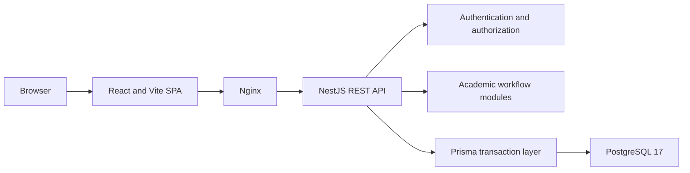

# SUMS — Smart University Management System

SUMS is a full-stack, bilingual university management system for the University of Palestine. It provides Arabic RTL and English LTR interfaces, role-based academic workflows, a versioned REST API, PostgreSQL persistence, reporting, and auditable security controls.

> **Project status:** development and demonstration. The seeded identities and academic records are fictional. Review the production-hardening checklist before using SUMS with real university data.

## Contents

- [Features](#features)
- [Roles](#roles)
- [Architecture](#architecture)
- [Technology stack](#technology-stack)
- [Quick start with Docker](#quick-start-with-docker)
- [Development users and passwords](#development-users-and-passwords)
- [Native development setup](#native-development-setup)
- [Database](#database)
- [Environment variables](#environment-variables)
- [Available commands](#available-commands)
- [Testing and verification](#testing-and-verification)
- [API and service URLs](#api-and-service-urls)
- [Repository structure](#repository-structure)
- [Troubleshooting](#troubleshooting)
- [GitHub and security safety](#github-and-security-safety)
- [Additional documentation](#additional-documentation)

## Features

- Bilingual Arabic/English interface with automatic RTL/LTR layout switching.
- Authentication by email, university ID, or employee ID.
- Nine role-based workspaces with database-backed authorization.
- Short-lived JWT access tokens and rotated HttpOnly refresh cookies.
- Student profiles, programs, curricula, terms, courses, sections, and schedules.
- Registration submission, scoped review, finalization, enrollment, and waitlists.
- Attendance sessions, records, adjustment requests, and department approval.
- Gradebooks, assessments, score entry, grade submission, publication, and appeals.
- Student transcripts and degree-progress calculations.
- Announcements, dashboards, analytics, and scoped reports.
- PDF, XLSX, and CSV report exports.
- Immutable audit logging and request ID correlation.
- Docker Compose deployment with PostgreSQL, migrations, API, Nginx, and web client.
- Unit, integration, API E2E, and browser E2E test suites.

## Roles

SUMS supports these nine roles:

| Role key       | Display role                 | Main responsibility                                                         |
| -------------- | ---------------------------- | --------------------------------------------------------------------------- |
| `student`      | Student                      | Registration, schedule, attendance, grades, transcript, and degree progress |
| `instructor`   | Instructor                   | Assigned courses, attendance, gradebooks, and announcements                 |
| `advisor`      | Academic Advisor             | Advisee review, registration decisions, and student progress                |
| `registrar`    | Registration Staff           | Students, terms, courses, sections, and registration finalization           |
| `depthead`     | Department Head              | Department oversight, attendance approval, and grade publication            |
| `coordinator`  | Program Coordinator          | Curriculum, program students, progress, and reports                         |
| `dean`         | Dean / University Management | Faculty-level dashboards, staff, and reports                                |
| `uniregistrar` | University Registrar         | University-wide academic administration and policy oversight                |
| `admin`        | System Administrator         | Users, roles, settings, audit records, and system administration            |

Authorization is enforced by the backend. Selecting a role in the frontend does not grant that role unless the authenticated user has an active database assignment.

## Architecture



SUMS is a modular monolith with a separately built single-page web application:

1. React renders the bilingual role workspaces and calls `/api/v1`.
2. Nginx serves static assets and proxies API requests in Docker.
3. NestJS validates requests and enforces authentication, permissions, ownership, and organizational scope.
4. Prisma performs typed persistence and transactional academic workflows.
5. PostgreSQL stores users, roles, sessions, academic records, policies, and audit entries.

## Technology stack

| Layer          | Technologies                                          |
| -------------- | ----------------------------------------------------- |
| Web            | React 18, TypeScript, Vite, TanStack Query            |
| API            | NestJS 11, TypeScript, Swagger / OpenAPI              |
| Database       | PostgreSQL 17, Prisma 6                               |
| Authentication | Argon2id, JWT access tokens, rotated refresh tokens   |
| Reports        | PDFKit, ExcelJS, CSV                                  |
| Quality        | ESLint, Prettier, Vitest, Jest, Supertest, Playwright |
| Deployment     | Docker Compose, Nginx                                 |

## Quick start with Docker

Docker is the recommended setup for teammates because it does not require a separate local Node.js or PostgreSQL installation.

### 1. Install prerequisites

- [Git](https://git-scm.com/)
- [Docker Desktop](https://www.docker.com/products/docker-desktop/) with Docker Compose

Ensure Docker Desktop is running and port `8080` is available.

### 2. Clone the repository

```powershell
git clone <YOUR-GITHUB-REPOSITORY-URL>
cd SUMS-repo
```

### 3. Create the local environment file

```powershell
Copy-Item .env.example .env
notepad .env
```

Use this development configuration, replacing the database password and JWT secret:

```dotenv
VITE_API_BASE_URL=/api/v1
POSTGRES_DB=sums
POSTGRES_USER=sums
POSTGRES_PASSWORD=<LOCAL_DATABASE_PASSWORD>
JWT_ACCESS_SECRET=<RANDOM_VALUE_WITH_AT_LEAST_32_CHARACTERS>
SEED_DEMO_PASSWORD=SumsDemo!2026
WEB_PORT=8080
```

Generate a random 64-character JWT secret in PowerShell:

```powershell
$bytes = New-Object byte[] 32
$rng = [System.Security.Cryptography.RandomNumberGenerator]::Create()
$rng.GetBytes($bytes)
$jwtSecret = -join ($bytes | ForEach-Object { $_.ToString('x2') })
$jwtSecret
$rng.Dispose()
```

Copy the printed value into `JWT_ACCESS_SECRET`. The `.env` file is ignored by Git and must never be committed.

### 4. Build and start the project

```powershell
docker compose up --build -d
docker compose ps
```

Docker starts:

- PostgreSQL and its persistent volume.
- A one-time migration container.
- The NestJS API.
- The React application behind Nginx.

The `migrate` container showing `Exited (0)` is normal: it exits after successfully applying the committed migrations.

### 5. Load the development dataset

The Docker startup does not seed demo data automatically. Run:

```powershell
docker compose run --rm -e NODE_ENV=development -e SEED_DEMO_PASSWORD=SumsDemo!2026 migrate ./node_modules/.bin/tsx server/prisma/seed.ts
```

The seed is idempotent, so it can safely update the fictional development dataset when run again. Seeding is blocked when `NODE_ENV=production`.

### 6. Open the application

Open:

```text
http://localhost:8080/
```

Use any account from the development-user tables below.

### 7. Verify health

```powershell
(Invoke-WebRequest -UseBasicParsing http://localhost:8080/healthz).StatusCode
(Invoke-WebRequest -UseBasicParsing http://localhost:8080/api/v1/health/ready).StatusCode
docker compose ps
```

Both requests should return `200`.

## Development users and passwords

All accounts below are fictional and intended only for local development.

### Primary account for every role

Every primary demo account uses this password:

```text
SumsDemo!2026
```

If a teammate seeds with a different `SEED_DEMO_PASSWORD`, that value replaces the password for all seeded users.

| Role                         | Name           | Email                    | University/employee ID | Password        |
| ---------------------------- | -------------- | ------------------------ | ---------------------- | --------------- |
| Student                      | Layla Nassar   | `student@up.edu.ps`      | `2202100054`           | `SumsDemo!2026` |
| Instructor                   | Ahmad Khalil   | `instructor@up.edu.ps`   | `E20260001`            | `SumsDemo!2026` |
| Academic Advisor             | Mona Saleh     | `advisor@up.edu.ps`      | `E20260002`            | `SumsDemo!2026` |
| Registration Staff           | Kareem Odeh    | `registrar@up.edu.ps`    | `E20260003`            | `SumsDemo!2026` |
| System Administrator         | System Admin   | `admin@up.edu.ps`        | `E20260004`            | `SumsDemo!2026` |
| Department Head              | Huda Nassar    | `depthead@up.edu.ps`     | `E20260005`            | `SumsDemo!2026` |
| Program Coordinator          | Rana Ali       | `coordinator@up.edu.ps`  | `E20260006`            | `SumsDemo!2026` |
| Dean / University Management | Sami Barghouti | `dean@up.edu.ps`         | `E20260007`            | `SumsDemo!2026` |
| University Registrar         | Tariq Mansour  | `uniregistrar@up.edu.ps` | `E20260008`            | `SumsDemo!2026` |

Users can sign in with their email or their university/employee ID. The selected login role must match an assigned role.

### Additional student dataset

These students use the same `SEED_DEMO_PASSWORD`:

| Name         | Email                    | University ID | Seeded cumulative GPA |
| ------------ | ------------------------ | ------------- | --------------------- |
| Omar Haddad  | `omar.haddad@up.edu.ps`  | `1202200019`  | 3.10                  |
| Sara Mansour | `sara.mansour@up.edu.ps` | `2202200044`  | 3.44                  |
| Yousef Ali   | `yousef.ali@up.edu.ps`   | `1202100088`  | 1.47                  |
| Nour Khalil  | `nour.khalil@up.edu.ps`  | `2202200101`  | 3.88                  |
| Rami Saleh   | `rami.saleh@up.edu.ps`   | `1202100133`  | 3.12                  |

Three incorrect passwords lock an account for 15 minutes. The API intentionally returns the generic `INVALID_CREDENTIALS` response for both incorrect passwords and locked accounts.

## Native development setup

Use this option when actively developing outside Docker.

### Requirements

- Node.js 22 LTS
- npm
- PostgreSQL 17

### Install and configure

```powershell
git clone <YOUR-GITHUB-REPOSITORY-URL>
cd SUMS-repo
npm ci
Copy-Item server/.env.example server/.env
notepad server/.env
```

Set `DATABASE_URL`, `JWT_ACCESS_SECRET`, `SEED_DEMO_PASSWORD`, and the remaining values in `server/.env`. The PostgreSQL user and database in `DATABASE_URL` must already exist.

Then run:

```powershell
npm run db:generate
npm run db:migrate
npm run db:seed
npm run dev
```

Native development URLs:

- Web: `http://localhost:5173`
- API: `http://localhost:3000/api/v1`
- Swagger UI: `http://localhost:3000/api/docs`

Vite proxies `/api` requests to port `3000`.

## Database

### Database source files

| Purpose                    | Location                                                        |
| -------------------------- | --------------------------------------------------------------- |
| Prisma data model          | `server/prisma/schema.prisma`                                   |
| Committed migration        | `server/prisma/migrations/20260728190000_initial/migration.sql` |
| Development dataset        | `server/prisma/seed.ts`                                         |
| Standalone schema-only SQL | `database/SUMS_schema.sql`                                      |

The schema-only SQL file contains no user rows, password hashes, tokens, sessions, or runtime records. The TypeScript seed creates the fictional users and academic data.

For a normal installation, use Prisma migrations followed by the seed. Do not import `SUMS_schema.sql` and then run the initial migration against the same empty database, because both create the same schema.

### Docker database storage

Docker stores the live PostgreSQL database in the named volume:

```text
sums-repo_sums_postgres_data
```

Access the running database:

```powershell
docker compose exec postgres psql -U sums -d sums
```

Useful `psql` commands:

```text
\dt
\d "User"
\q
```

Stop containers while keeping the database:

```powershell
docker compose down
```

Delete all local database data only when intentionally resetting development:

```powershell
docker compose down -v
docker compose up --build -d
```

The `-v` option permanently deletes the local SUMS database volume. Run the seed again afterward.

## Environment variables

### Docker `.env`

| Variable             | Required         | Purpose                                             |
| -------------------- | ---------------- | --------------------------------------------------- |
| `VITE_API_BASE_URL`  | Yes              | Browser API base path; normally `/api/v1`           |
| `POSTGRES_DB`        | Yes              | PostgreSQL database name                            |
| `POSTGRES_USER`      | Yes              | PostgreSQL application user                         |
| `POSTGRES_PASSWORD`  | Yes              | Local database password                             |
| `JWT_ACCESS_SECRET`  | Yes              | Access-token signing secret, at least 32 characters |
| `SEED_DEMO_PASSWORD` | Development seed | Shared fictional-user password                      |
| `WEB_PORT`           | No               | Host web port; defaults to `8080`                   |

### API `server/.env`

The native API template additionally includes:

- `NODE_ENV`
- `PORT`
- `DATABASE_URL`
- `ACCESS_TOKEN_TTL_SECONDS`
- `REFRESH_TOKEN_TTL_DAYS`
- `COOKIE_SECURE`
- `COOKIE_DOMAIN`
- `CORS_ORIGINS`
- `LOG_LEVEL`
- `PASSWORD_RESET_URL`
- `TRUST_PROXY`

Use placeholder values only in committed `.env.example` files. Put real secrets in untracked local files or a deployment secret manager.

## Available commands

Run these from the repository root:

| Command                   | Purpose                                |
| ------------------------- | -------------------------------------- |
| `npm run dev`             | Start web and API development servers  |
| `npm run dev:web`         | Start only Vite                        |
| `npm run dev:api`         | Start only NestJS in watch mode        |
| `npm run build`           | Build web and API                      |
| `npm run lint`            | Run ESLint                             |
| `npm run format`          | Format supported files                 |
| `npm run format:check`    | Check formatting                       |
| `npm run typecheck`       | Type-check web and API                 |
| `npm test`                | Run web and API unit/integration tests |
| `npm run test:api:e2e`    | Run database-backed API E2E tests      |
| `npm run test:e2e`        | Run Playwright browser tests           |
| `npm run db:generate`     | Generate the Prisma client             |
| `npm run db:migrate`      | Apply committed Prisma migrations      |
| `npm run db:seed`         | Load development data                  |
| `npm run db:reset:dev`    | Reset a development database           |
| `npm run prisma:format`   | Format the Prisma schema               |
| `npm run prisma:validate` | Validate the Prisma schema             |
| `npm run openapi:export`  | Export the OpenAPI document            |

## Testing and verification

Install Node.js dependencies before running host quality checks:

```powershell
npm ci
npm run format:check
npm run lint
npm run typecheck
npm test
npm run build
npm run prisma:format
npm run prisma:validate
```

Database-backed API E2E tests require a migrated and seeded test database:

```powershell
npm run test:api:e2e
```

Browser E2E tests require a running seeded API and web application:

```powershell
npm run test:e2e
```

## API and service URLs

### Docker

| Service         | URL                                         |
| --------------- | ------------------------------------------- |
| Web application | `http://localhost:8080/`                    |
| API base        | `http://localhost:8080/api/v1`              |
| Swagger UI      | `http://localhost:8080/api/docs`            |
| Web health      | `http://localhost:8080/healthz`             |
| API readiness   | `http://localhost:8080/api/v1/health/ready` |

### Native development

| Service         | URL                                         |
| --------------- | ------------------------------------------- |
| Web application | `http://localhost:5173/`                    |
| API base        | `http://localhost:3000/api/v1`              |
| Swagger UI      | `http://localhost:3000/api/docs`            |
| API readiness   | `http://localhost:3000/api/v1/health/ready` |

The login API is `POST /api/v1/auth/login`. Opening that URL directly in a browser sends a GET request and correctly returns `Cannot GET /api/v1/auth/login`. Always sign in through the web application root.

## Repository structure

```text
SUMS-repo/
├── src/                         React application, screens, API clients, and state
├── public/                      Static assets and design tokens
├── server/
│   ├── src/                     NestJS modules, guards, services, and controllers
│   ├── prisma/                  Prisma schema, migration, and seed
│   └── test/                    API end-to-end tests
├── database/                    Standalone schema-only SQL file
├── e2e/                         Playwright browser tests
├── deploy/                      Nginx configuration
├── docs/
│   ├── backend/                 Architecture, API, security, operations, and setup
│   └── baseline/                Approved requirements PDFs
├── .github/workflows/           Continuous integration
├── Dockerfile                   Web production image
├── docker-compose.yml           PostgreSQL, migration, API, and web services
└── package.json                 Root workspace scripts
```

## Troubleshooting

### `Cannot GET /api/v1/auth/login`

You opened the POST-only API endpoint as a web page. Open `http://localhost:8080/` instead.

### `INVALID_CREDENTIALS`

- Confirm the database was seeded.
- Use the same password supplied through `SEED_DEMO_PASSWORD`.
- Confirm the selected role matches the account.
- After three incorrect passwords, wait 15 minutes or have an administrator unlock the account.

### Migration reports PostgreSQL authentication failure

An existing Docker volume keeps the password used when PostgreSQL was first created. Changing `POSTGRES_PASSWORD` in `.env` does not change the existing database role.

For disposable development data, reset and recreate the volume:

```powershell
docker compose down -v
docker compose up --build -d
```

This permanently deletes the local database. Do not use it when the data must be preserved.

### Port 8080 is already in use

Change `WEB_PORT` in `.env`, for example:

```dotenv
WEB_PORT=8081
```

Then open `http://localhost:8081/`.

### View service logs

```powershell
docker compose logs api migrate postgres web --tail=200
```

### Check container health

```powershell
docker compose ps
```

## GitHub and security safety

Never commit:

- `.env` files
- Database passwords or production credentials
- JWT secrets, tokens, cookies, or session data
- `node_modules`
- Docker volumes
- Full database dumps containing user/runtime data
- Generated reports, exports, logs, coverage, or test artifacts

Before pushing:

```powershell
git status
git diff --stat
git check-ignore .env
git ls-files node_modules
```

If `git ls-files node_modules` prints files, remove them from Git tracking without deleting the local directory:

```powershell
git rm -r --cached node_modules
git status
```

The public `SumsDemo!2026` password is only for fictional local demo accounts. Never reuse it for real users, staging, or production.

## Additional documentation

- [Setup on another device](docs/SETUP_ON_ANOTHER_DEVICE.md)
- [Architecture](docs/backend/ARCHITECTURE.md)
- [API reference](docs/backend/API_REFERENCE.md)
- [Security design](docs/backend/SECURITY.md)
- [Operations runbook](docs/backend/RUNBOOK.md)
- [Assumptions and open questions](docs/backend/ASSUMPTIONS_AND_OPEN_QUESTIONS.md)
- [UI/API requirements traceability](docs/backend/UI_API_TRACEABILITY_MATRIX.md)

---

SUMS development seed data is fictional and must not be treated as an authoritative university record.
