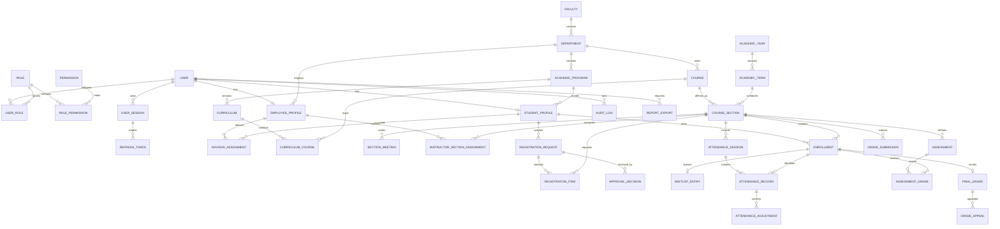

# Entity-Relationship Diagram

This is a deliberately compact view of the main transactional relationships. See `server/prisma/schema.prisma` for all fields, history tables, and constraints.

```mermaid
erDiagram
  USER ||--o{ USER_ROLE : assigned
  ROLE ||--o{ USER_ROLE : grants
  ROLE ||--o{ ROLE_PERMISSION : contains
  PERMISSION ||--o{ ROLE_PERMISSION : maps
  USER ||--o{ USER_SESSION : owns
  USER_SESSION ||--o{ REFRESH_TOKEN : rotates
  USER ||--o| STUDENT_PROFILE : has
  USER ||--o| EMPLOYEE_PROFILE : has

  FACULTY ||--o{ DEPARTMENT : contains
  DEPARTMENT ||--o{ ACADEMIC_PROGRAM : contains
  ACADEMIC_PROGRAM ||--o{ STUDENT_PROFILE : enrolls
  DEPARTMENT ||--o{ EMPLOYEE_PROFILE : employs
  EMPLOYEE_PROFILE ||--o{ ADVISOR_ASSIGNMENT : advises
  STUDENT_PROFILE ||--o{ ADVISOR_ASSIGNMENT : assigned

  ACADEMIC_YEAR ||--o{ ACADEMIC_TERM : contains
  DEPARTMENT ||--o{ COURSE : owns
  ACADEMIC_PROGRAM ||--o{ CURRICULUM : versions
  CURRICULUM ||--o{ CURRICULUM_COURSE : contains
  COURSE ||--o{ CURRICULUM_COURSE : maps
  COURSE ||--o{ COURSE_SECTION : offered_as
  ACADEMIC_TERM ||--o{ COURSE_SECTION : schedules
  COURSE_SECTION ||--o{ SECTION_MEETING : meets
  EMPLOYEE_PROFILE ||--o{ INSTRUCTOR_SECTION_ASSIGNMENT : teaches
  COURSE_SECTION ||--o{ INSTRUCTOR_SECTION_ASSIGNMENT : assigned

  STUDENT_PROFILE ||--o{ REGISTRATION_REQUEST : submits
  REGISTRATION_REQUEST ||--o{ REGISTRATION_ITEM : contains
  COURSE_SECTION ||--o{ REGISTRATION_ITEM : requests
  REGISTRATION_REQUEST ||--o{ APPROVAL_DECISION : reviewed_by
  STUDENT_PROFILE ||--o{ ENROLLMENT : owns
  COURSE_SECTION ||--o{ ENROLLMENT : contains
  ENROLLMENT ||--o| WAITLIST_ENTRY : queues

  COURSE_SECTION ||--o{ ATTENDANCE_SESSION : records
  ATTENDANCE_SESSION ||--o{ ATTENDANCE_RECORD : contains
  ENROLLMENT ||--o{ ATTENDANCE_RECORD : identifies
  ATTENDANCE_RECORD ||--o{ ATTENDANCE_ADJUSTMENT : corrects

  COURSE_SECTION ||--o{ ASSESSMENT : defines
  ASSESSMENT ||--o{ ASSESSMENT_GRADE : scores
  ENROLLMENT ||--o{ ASSESSMENT_GRADE : receives
  COURSE_SECTION ||--o{ GRADE_SUBMISSION : submits
  ENROLLMENT ||--o| FINAL_GRADE : results
  FINAL_GRADE ||--o{ GRADE_APPEAL : appealed

  USER ||--o{ AUDIT_LOG : acts
  USER ||--o{ REPORT_EXPORT : requests
```
